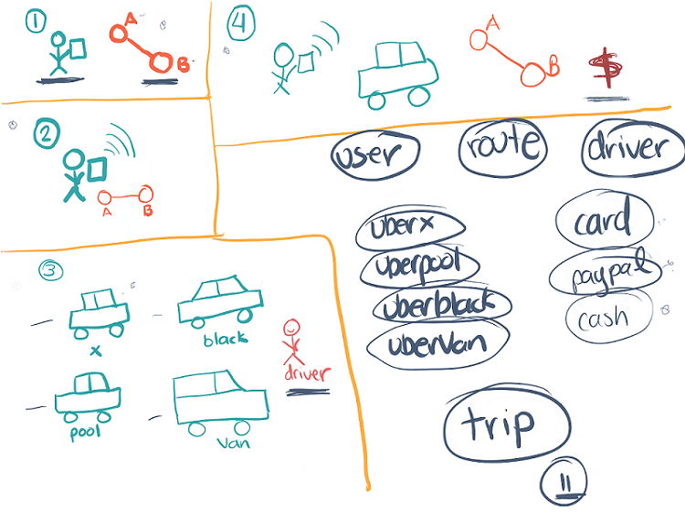

# Clase 11 *Analizando Uber en Objetos*

Ahora que aprendimos de modularidad sabemos que para resolver un problema debemos dividirlo en pequeños subproblemas y eso lo que haremos ahora mismo. Analizaremos nuestro proyecto Uber en pequeños subproblemas.

**Paso 1**

Solicitar un Uber nace de nuestra necesidad de trasladarnos del punto A al punto B, y para eso necesitamos un celular.

**Paso 2**

Solicitamos el auto y asignamos a la aplicación de donde a donde queremos desplazarnos.

**Paso 3**

Nos aparece un catálogo de autos a elegir: X, Pool, Black y Van. Además, también se encuentra el Conductor puesto que, sin importar el tipo de Uber a elegir, siempre estará involucrado.

**Paso 4**

Una vez elegido el auto, nosotros tenemos que únicamente esperar mientras el auto se dirige hacia nuestra ubicación y finalmente nos llevara del punto A al punto B. Ya, una vez nos esté llevando, será visible un saldo a cobrar por el viaje realizado.

Y ese es nuestro breve análisis de como funcionara nuestra aplicación Uber. Lo siguiente que aprendimos es que debemos analizar nuestros objetos y extraerlos.

**Objetos**

En el paso 1 tenemos a nuestro objeto **User (Usuario)** que estará solicitando el auto. Así como el objeto **Route (Ruta)** para trasladarnos.

En el paso 3 tenemos un catálogo con diferentes tipos de autos y eso significa diferentes tipos de objetos: **UberX**, **UberPool**, **UberBlack** y **UberVan**. Además, también tenemos nuestro objeto **Driver (Conductor)**.

Finalmente en el paso 4 podemos ver que cuando nuestro viaje fue realizado se nos cobrara un monto y eso significa que tendremos distintas formas de pagar ese viaje. Ya sea a través de un objeto **Card (Tarjeta)**, **PayPal** o **Cash**.

También tenemos un último objeto que es del tipo conceptual y está presente durante todo nuestro análisis, ese es el objeto **Trip (Viaje)** que captura quien ejecuta el viaje, a donde quieres ir, que auto elegiste y que forma de pago realizaras.