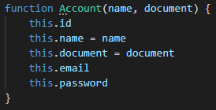

# Clase 22 *Declarando un Método Constructor en Java y JavaScript*

En la clase anterior vimos como declarar el método constructor en el caso de Java y Python, hoy vamos a ponerlo en acción para el caso particular de JavaScript y Java.

**JAVA**

Primeramente lo veremos en el caso de Java para entenderlo mejor, porque en JavaScript es bastante peculiar.

Lo que haremos es ir a la clase Car en donde crearemos nuestro método constructor:

- **public:** Indica que es un método accesible a través de una instancia del objeto.
- **Car():** Es el nombre que tendrá nuestro método.
	- Dentro de las paréntesis van  los parámetros obligatorios para crear un objeto de tipo Car. En este caso, lo mínimo necesario es license y drive.
- Dentro del constructor ponemos this., y esto no es más que una buena práctica porque se acostumbra mucho que los parámetros tengan el mismo nombre que las propiedades.

	- **this.license:** Hace referencia al license, la variable global de la clase.
	- **license:** Hace referencia al parámetro license, la variable local que existen únicamente dentro del método.

-  Ahora en nuestro método printDataCar si lo dejamos tal cual no imprimirá lo que estamos queriendo, por eso debemos cambiarlo y poner **driver.name**.

Hasta ahora también hemos estado manejando driver como un string, pero sabemos que en realidad es de tipo Account, así que debemos ir a la clase Account para crear su método constructor:
	

Ya hecho una vez todo esto y ejecutamos nuestro programa nos indicara un error, porque no hemos realizado los demás cambios. Cuando sobrescribimos el método automáticamente el método vacío que teníamos se pierde, así que para pasar los datos debemos hacerlo dentro de las paréntesis:

- Como podemos ver, siendo nuestro driver del tipo Account debemos declararlo para que se cree un objeto.

Con esto tenemos los datos mínimos necesarios para que un vehículo exista dentro de nuestra aplicación Uber.

**JAVASCRIPT**

Primero debemos crear un archivo HTML llamado index que funcionara como nuestro Main, esto es porque JavaScript necesita un navegador que nos permita visualizar todo.

En nuestro archivo index.html tendremos lo siguiente:

Es un esqueleto básico del HTML, lo importante está dentro del body donde tenemos tres scripts que nos permitirá incluir o llamar nuestro código de tipo JavaScript. Es importante ponerlos en ese orden porque de lo contrario no nos funcionara, esto es porque JavaScript empieza a compilar y renderizar desde el principio a medida que va leyendo línea por línea.

Ahora vamos a nuestra clase Car:

- Como podemos ver, no es necesitamos colocar el tipo de dato que tendrán los parámetros. Además los atributos que creamos ya son tomados como parte del método constructor y simplemente debemos igualar.
- Es en la creación del método **printDataCar** donde esta lo interesante. Sabemos que JavaScript toma los métodos como funciones especiales y son declarados fuera.
- Para imprimir nuestro resultado usamos el comando **console.log** que imprime en la consola.
- Una forma de concatenar string es la interpolación de cadenas y utilizan las comillas invertidas o backticks para delimitar sus contenidos. Las partes variables se denominan placeholders y utilizan la sintaxis ${ } para diferenciarse del resto de la cadena.
	
Ahora vamos a nuestra clase Account para pasar el nombre y el documento:

¿Recuerdas a index.js? Hasta el momento ha permanecido vacío, pero lo usaremos para poner ahí todas las llamadas de nuestra clases y posteriormente mostrarlas. Entonces, vamos a index.js:
	

- Declaramos un objeto **car** al que pasaremos los datos de la matrícula y del conductor.
- Incluso podemos usar el operador punto para acceder a la cantidad de pasajeros y usar nuestro método printDataCar.

Finalmente, para ver nuestros resultados, debemos abrir nuestro archivo HTML en un navegador. En el navegador damos click derecho, inspeccionar y vamos a consola, y ahí esta imprimido en pantalla nuestra clase de hoy.