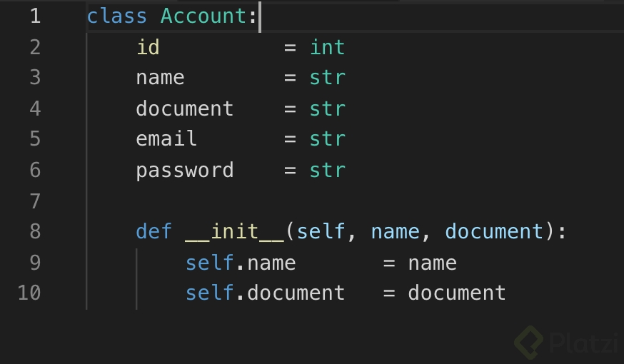
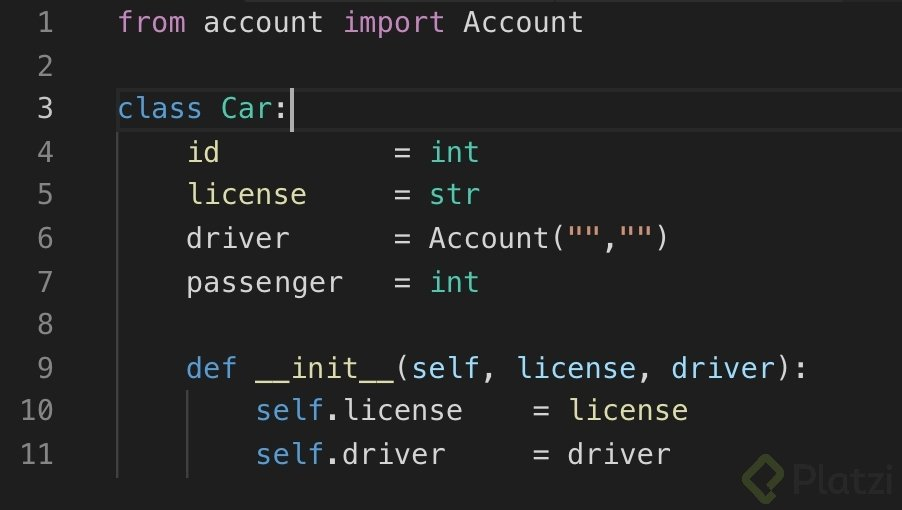

# Clase 24 *Declarando un Método Constructor en Python*

En Python encontrarás un concepto denominado Métodos Mágicos, estos métodos son llamados automáticamente y estrictamente bajo ciertas reglas. El método constructor en Python forma parte de esta familia de métodos y como aprendimos en la clase anterior lo declaramos usando __init__, aunque si nos ponemos estrictos este método no construye el objeto en sí. El encargado de hacer esto es __new__ y el método __init__ se encargará de personalizar la instanciación de la clase, esto significa que lo que esté dentro de __init__ será lo primero que se ejecute cuando se cree un objeto de esta clase.

Para nuestro proyecto tenemos la necesidad de que algunas variables se inicialicen obligatoriamente cuando ocurra la instanciación. Así que declaremos el método __init__ en las clases de nuestro proyecto con las propiedades obligatorias.

Para la clase Account quedaría algo así, notarás que usamos la palabra clave self, esta es muy parecida a lo que venimos trabajando a otros lenguajes con this. Y como su nombre lo dice hace referencia a los datos que componen la clase, en este caso self.name está llamando al atributo name que se encuentra en la línea 3 de la clase y, le está asignando el dato que se pasa en el método __init__ de la línea 8.

Ahora veamos la clase Car:

Lo que notarás de diferente es que cambiamos el tipo de dato de driver, ahora es de tipo Account y como ves está solicitando los dos datos obligatorios para instanciar un objeto de este tipo. Esto lo verás más en acción en el próximo fragmento de código del archivo main.py. Además, mucho ojo, en la primera línea observamos que es importante importar la clase para poderla usar.

Nuestro archivo main.py ahora se verá así:

Observa que estamos importando las dos clases que usaremos y las estamos instanciando en los métodos constructores.

Los resultados serán los siguientes:

El código de este ejemplo lo encuentras en este [enlace](https://www.wireshark.org/(https://github.com/anncode1/Curso-POO-Platzi/tree/3.2.ConstructorPython) "enlace").

**Reto 3**

- Ahora que ya viste cómo creamos un método constructor en Python, mira esta [clase](https://platzi.com/clases/1338-php/12930-constructor-y-metodos/ "clase") y hazlo también para PHP. Compártenos tus resultados en la sección de discusiones.