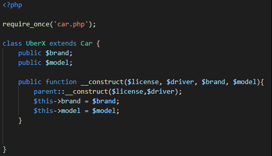

# Clase 25 *Aplicando herencia en lenguaje Java y PHP*

Ya sabemos cómo funciona la herencia de manera conceptual, pero aún lo hemos visto expresada en código dependiendo del lenguaje de programación que elijas. Y es que esto varía dependiendo de lo que estés eligiendo:

- **Java:** Para crear una subclase se usa la palabra reservada extends, esto le indica a la clase hija cual va a ser su clase padre.
  
	
		
- **Python:** Usamos la palabra class seguido del nombre de la clase hija, se la pone entre paréntesis pasamos la clase padre como parámetro.
  
	
		
- **JavaScript:** Ha sido nuestro amigo rebelde durante todo el curso, por lo que no es de extrañar que JavaScript herede de una manera peculiar y es que simplemente toma a la clase hija seguido de la palabra prototype e inmediatamente instancia la clase padre.

	
		
- **PHP:** Esté lenguaje maneja la herencia de manera similar a Java, usando la palabra extends.

**JAVA**

Siguiendo con la clase Car es tiempo de crear los objetos que descienden de esté, para eso creamos cuatro archivos que serán nuestras clases UberX, UberPool, UberBlack y UberVan.

UberX y UberPool

- Creamos las clases y usamos extends para señalar que estamos heredando de la clase Car, creamos los atributos propios y después creamos un constructor que reciba cuatros parámetros.
- **super():** sirve para llamar al constructor de la clase padre.

UberBack y UberVan

- Importamos el ArrayList y Map de la biblioteca java.util
- **Map:** Es una interfaz que define el conducta general de una estructura que se hace relación de clave/valor.
- Creamos las clases y usamos extends para señalar que estamos heredando de la clase Car, creamos los atributos propios y después creamos un constructor que reciba cuatros parámetros.
- **super():** sirve para llamar al constructor de la clase padre.

**PHP**

Al igual que en Java, también creamos cuatro archivos nuevos que serán nuestras clases.

Tenemos nuestra clase Car:

Y ahora crearemos una clase UberX:

	
- **require_once:** Inserta en nuestro programa un código procedente de otro archivo, si el archivo no existe o contiene errores, nuestro programa no funcionará y obtendremos un fatal error.
- **extends:** Indicamos a la clase hija cual va a ser su clase padre.
- Los constructores padres no son llamados implícitamente si la clase hija define un constructor. Para ejecutar un constructor padre, se requiere invocar a **parent::__construct()** desde el constructor hijo. Si el hijo no define un constructor, entonces se puede heredar de la clase madre como un método de clase normal (si no fue declarada como privada).

**Reto 4**

- Termina las clases de PHP en Uber.