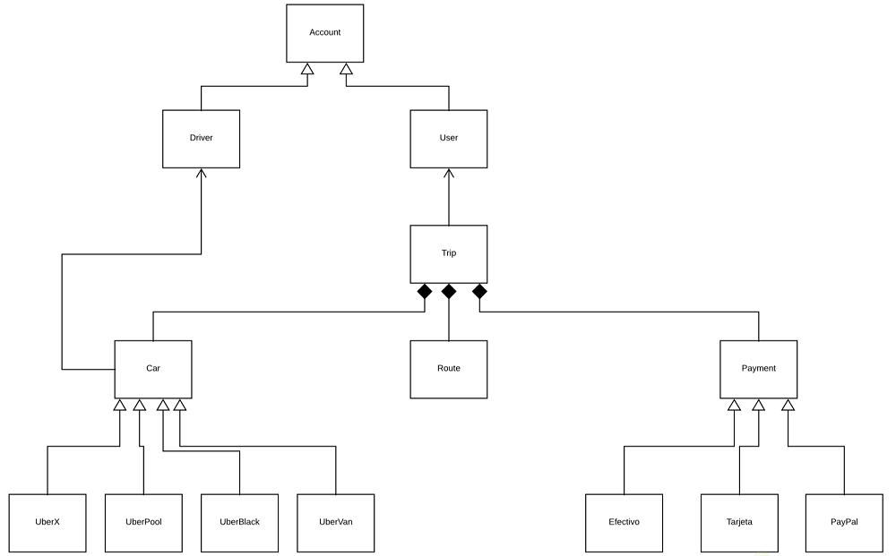
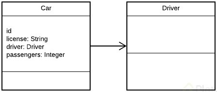
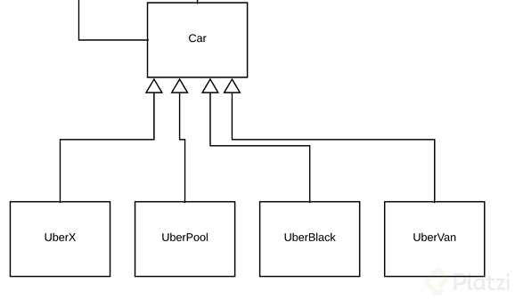
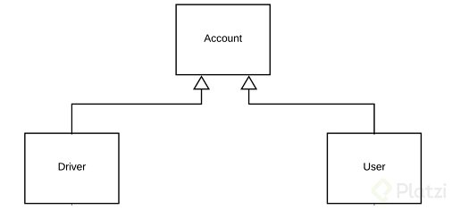
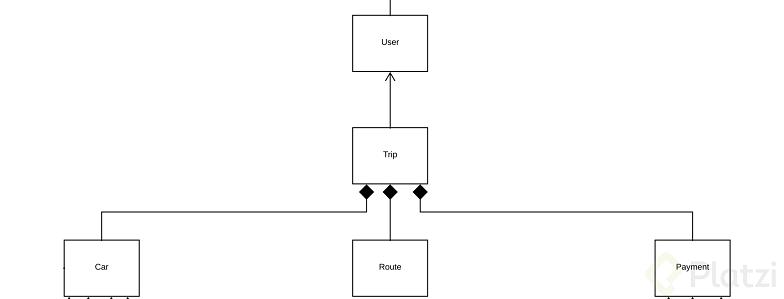

# Clase 33 *El Diagrama UML de Uber*

Este es el diagrama que finalmente obtuvimos, aquí solo faltaría añadirle los atributos que posee cada clase.

Recopilemos todo lo que hemos aprendido para explicar los últimos detalles.

En primer lugar notarás que tenemos 3 tipos de flechas:

**Asociación**

Como su nombre lo dice, notarás que cada vez que esté referenciada este tipo de flecha significará que ese elemento contiene al otro en su definición. Si recuerdas la clase Car, este contenía una instancia de Driver. La flecha apuntará hacia la dependencia.

**Herencia**

Siempre que veamos este tipo de flecha se estará expresando la herencia.

En nuestro diagrama tuvimos al menos tres familias conviviendo. La dirección de la flecha irá desde el hijo hasta el padre.

**Familia Car**

**Familia Account**

**Familia Payment**

**Composición**

Pasemos a una de nuestras piezas claves, pues notarás en el centro del diagrama la clase Trip que está vinculada a User, Car, Route y Payment. La composición va a significar una asociación entre estas clases con la diferencia de que para que esta clase pueda vivir forzosamente necesita a las demás. Es decir que estas clases son obligatorias para que la clase Trip pueda existir, esta dependencia obligatoria podríamos expresarla en el método constructor de la clase Trip, pues para que un objeto pueda ser creado dependerá de que los demás existan.

Esta clase Trip poseerá la lógica más fuerte del negocio aquí será donde se concentrarán la mayor cantidad de clases.

Esto es todo nuestro diagrama de clases, que quedó totalmente expresado en nuestro proyecto.